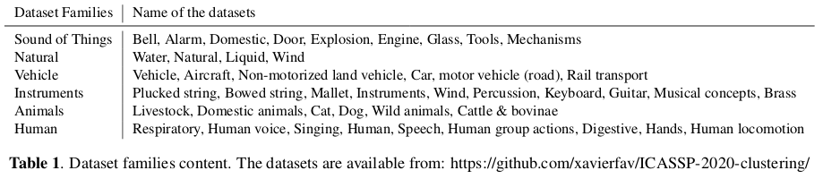
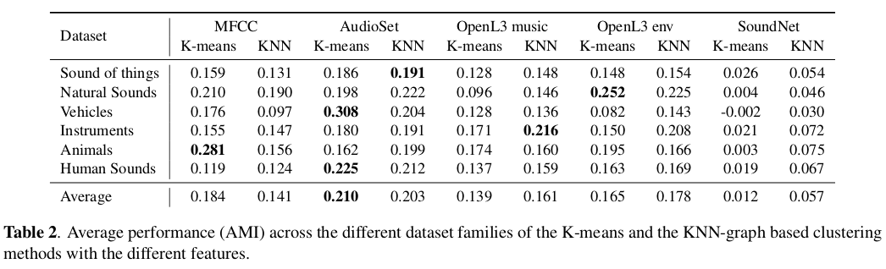

# A comparison of audio features for the unsupervised classification of sounds

This repository hosts some code for evaluating different features for the unsupervised classification (clustering) of audio content from [Freesound](https://freesound.org/).
The clustering performance is evaluated on different datasets using an external cluster validation, which consists in comparing the results of a clustering to an externally known result (provided ground truth labels). The data has been collected within the [Freesound Annotator](https://annotator.freesound.org/) platform, which hosts the [FSD](https://annotator.freesound.org/fsd/explore/) dataset containing sounds organised following the [AudioSet Ontology](https://research.google.com/audioset/ontology/index.html).

We compare the clustering performance of two different methods: K-means and a graph-based approach.

The graph-based approach consists on partitioning a K-Nearest Neighbors Graph of sounds.
In this graph, each node corresponds to a sound.
Edges between nodes reflect a notion of content-based similarity calculated on a feature space, for instance, using the [AudioSet](https://research.google.com/audioset/) embeddings.
Clusters in the graph are identified using a Louvain community detection algorithm [implementation](https://github.com/taynaud/python-louvain/tree/networkx2) with the [NetworkX](https://networkx.github.io/) Python package.


## Datasets

In the `datasets/` directory, you can find one JSON file per dataset, which provides the IDs of the Freesound sounds for each classes of the AudioSet Ontology. You can download the sounds using the Freesound API by yourself (you can contact me for some help on this). 
You can refer to the `json/ontology.json` file for relating the dataset category IDs to their corresponding name. Table 1 below provides an overview of the datasets organised in 6 families.




## Experiment

We evaluated the methods and features with several datasets. 
In the `results_experiment_feature_comparison/` directory, you can find the pre-computed clustering the datasets with the two different clustering methods, and with the different features: AudioSet embeddings, OpenL3 embeddings (music and env), SoundNet embeddings and MFCC features. Table 2 below shows the performance of the different method and features averaged on the different families of datasets. 




## Setup

- Install dependencies in a virtual environment:
  ```
  python3 -m venv venv
  source venv/bin/activate
  pip install -r requirements.txt
  ```

- Copy the `settings.example.py` file to `settings.py`, open it, and follow the instructions. Here we basically configure were the audio features of the sound files have to be located in the computer.
  ```
  cp settings.example.py settings.py
  ```

- As you might now understand, you need to have a folder containing the pre-calculated audio features for the sounds in the different datasets. There are in total around 30k sounds (with freesound IDs in `all_sound_ids.json`) and 44 datasets (JSON files in `datasets/`).

- You can start the clusterings by typing:
  ```
  python clustering.py
  ```
  This will output some results in the console and save the results in `datasets_clustered/`.
  It will also save the clustered graph so that we can visualise them in a 2D representation.

- You can start the visualisation web server by typing:
  ```
  python web-visu/start_server.py
  ```
  Then you can access the web app from your browser at: `http://localhost:8100/web-visu/`.


